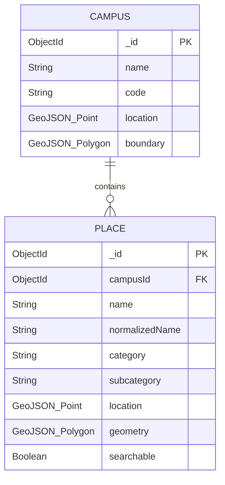

# DISHAA Database Foundation Documentation

## Overview & Architecture Strategy

DISHAA is a Virtual Campus Navigation System. The database architecture is designed with a clear separation of concerns:

- **MongoDB (Mongoose)**: Stores **semantic campus information** — campuses, buildings, canteens, hostels, gates, offices, sports facilities, parking areas, and descriptive metadata.
- **Valhalla**: Handles the **routing graph network** — road networks, footways, walkways, turn-by-turn routing calculations, and pathfinding.

> [!IMPORTANT]
> **No Routing Graph in MongoDB**: Roads, paths, footways, and sidewalks are **not** stored as routing graphs inside MongoDB. Valhalla processes the OSM road graph separately. MongoDB only stores searchable destination entities and campus semantic metadata.

---

## GeoJSON Standards & Conventions

All spatial locations and geometries in MongoDB follow standard GeoJSON specifications (RFC 7946):

- Coordinate Order: **`[longitude, latitude]`**
- Longitude range: `-180` to `180`
- Latitude range: `-90` to `90`

> [!CAUTION]
> Do NOT use `[latitude, longitude]`. GeoJSON standards require longitude first.

---

## Core Collections

### 1. `campuses` Collection

Represents an academic campus or facility zone.

#### Schema Definition (`Campus`)

| Field | Type | Required | Description |
| :--- | :--- | :--- | :--- |
| `name` | String | Yes | Full campus name (unique, trimmed) |
| `code` | String | No | Short campus code (e.g., `GHRCEM`) |
| `description` | String | No | General description of the campus |
| `address` | Object | No | `{ street, city, state, postalCode, country }` |
| `location` | GeoJSON Point | Yes | Center point of campus `{ type: "Point", coordinates: [lon, lat] }` |
| `boundary` | GeoJSON Polygon / MultiPolygon | No | Outer boundary polygon of the campus area |
| `metadata` | Map / Object | No | Extensible key-value pairs (contact, website, etc.) |
| `createdAt` | Date | Auto | Timestamp of document creation |
| `updatedAt` | Date | Auto | Timestamp of document update |

#### Indexes
- **`2dsphere`** on `location` (Geospatial center proximity)
- **`2dsphere`** on `boundary` (sparse, boundary spatial inclusion)

---

### 2. `places` Collection

Primary searchable collection containing campus points of interest (POIs), buildings, facilities, and amenities.

#### Schema Definition (`Place`)

| Field | Type | Required | Description |
| :--- | :--- | :--- | :--- |
| `campusId` | ObjectId | Yes | Reference to `Campus._id` |
| `name` | String | Yes | Display name of the place (e.g., `Block A`, `Canteen 1`) |
| `normalizedName` | String | Yes | Lowercased, trimmed string for case-insensitive search |
| `category` | String | Yes | Primary category (enum: `building`, `hostel`, `food`, `parking`, `sports`, `gate`, `office`, `facility`, `academic`, `other`) |
| `subcategory` | String | No | Detailed classification (e.g., `canteen`, `cafe`, `volleyball_court`, `security_gate`) |
| `description` | String | No | Descriptive information about departments or services located here |
| `location` | GeoJSON Point | Yes | Primary entrance or center coordinate `{ type: "Point", coordinates: [lon, lat] }` |
| `geometry` | GeoJSON Polygon / MultiPolygon | No | Footprint polygon of the building or facility area |
| `searchable` | Boolean | Default `true` | Controls visibility in user search results |
| `metadata` | Map / Object | No | Extensible store for images, tags, floor count, building codes |
| `createdAt` | Date | Auto | Timestamp of document creation |
| `updatedAt` | Date | Auto | Timestamp of document update |

#### Supported Categories
- `building`: Academic blocks, administrative buildings
- `hostel`: Boys hostel, girls hostel
- `food`: Canteens, cafes, food stalls
- `parking`: Staff parking, student parking
- `sports`: Volleyball courts, futsal ground, basketball court, gym
- `gate`: Main gate, entrance security office
- `office`: Accounts section, student section, department offices
- `facility`: Xerox center, temple, library, restrooms
- `academic`: Classrooms, departments, laboratories
- `other`: Miscellaneous campus points

#### Indexes
- **`2dsphere`** on `location` (Geospatial proximity search `$near`, `$nearSphere`)
- **`2dsphere`** on `geometry` (sparse, area containment `$geoWithin`)
- **Compound Index** `{ campusId: 1, category: 1 }` (Category filtering by campus)
- **Compound Index** `{ campusId: 1, normalizedName: 1 }` (Name lookup by campus)
- **Text Index** on `{ name: 'text', normalizedName: 'text', description: 'text' }` (Text search)

---

## Entity Relationships



- Each **`Place`** belongs to exactly one **`Campus`** via `campusId`.
- A **`Campus`** can contain many **`Places`**.

---

## Future Integration & Agent Compatibility

### 1. Outdoor Campus Navigation
When a user searches for a destination (e.g., "Canteen 1"), MongoDB returns the `Place` document including its GeoJSON `location` `[longitude, latitude]`.

### 2. Valhalla Route Calculation
The start coordinate (user location) and destination coordinate (`Place.location.coordinates`) are sent to Valhalla's route engine to generate turn-by-turn road paths.

### 3. AI Agent (LangGraph.js + Ollama)
Future AI tools will interface cleanly with this database foundation:
- `searchPlace(query)`: Performs text/regex search on `Place.normalizedName` and `name`.
- `getPlaceDetails(placeId)`: Retrieves complete `Place` metadata, description, and subcategory.
- `findNearbyPlaces(longitude, latitude, category, radius)`: Uses MongoDB `$near` query on `Place.location`.

---

## Import & Validation Commands

To populate or update the MongoDB database from `data/reference/campus.geojson`:

```bash
# Idempotent Data Import
npm run import

# Full Database & Imported Data Validation
npm run validate:db
```

### Import Execution & Verification Results

- **Campus Records**: 1 (`GHRCEM Campus`, center: `[79.003112, 21.124578]`, boundary Polygon)
- **Place Records**: 32 searchable places categorized as:
  - `sports` (6): Futsal, Basketball, Ground, Handball, Green GYM, Horses
  - `food` (5): Canteen 1, Sandwich Cafe, Siddhi Cafe, NesCafe, Chaap Centre
  - `academic` (5): Block A, Block B, Block C, Workshop, Training Centre
  - `office` (4): Students Section, Account Section, G H R C E M Office, Administrative & Security Office
  - `facility` (4): Xerox Center, Mata di Temple, Sitting Area, Lawn
  - `parking` (3): Students Parking, Staff Parking, Bus Area
  - `hostel` (2): Girls Hostel, Boys Hostel
  - `other` (2): Outer Boundary Wall A, Outer Boundary Wall B
  - `gate` (1): Main Entrance Gate
- **Excluded / Non-Place Features (4 Features Reconciled)**:
  - **`way/848874321`**: Campus Administrative Boundary (`boundary=administrative`, `college=GHRCEM`) — Stored as `Campus.boundary` and center location in the `Campus` collection.
  - **`way/1304123444`**: Campus Educational Land-Use Area (`landuse=education`, `name=G H R C E M`) — Campus footprint land-use area associated with the overall `Campus` territory.
  - **`way/848874322`**: Industrial Edge Plot (`landuse=industrial`) — External industrial plot on campus boundary edge, excluded from `Place` data.
  - **`way/1537929854`**: Unnamed Building Footprint (`building=yes`) — Unverified unnamed footprint excluded from searchable `Place` data.
- **Routing Infrastructure Features (25 Features)**:
  - Excluded from MongoDB (reserved strictly for Valhalla turn-by-turn routing graph).


