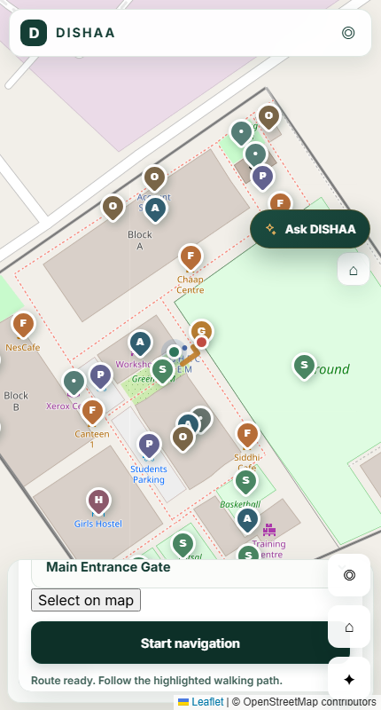
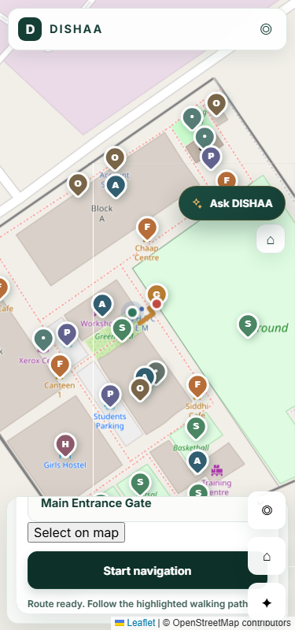
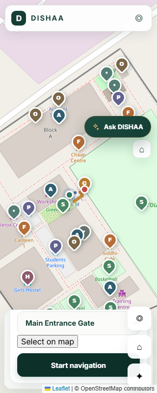
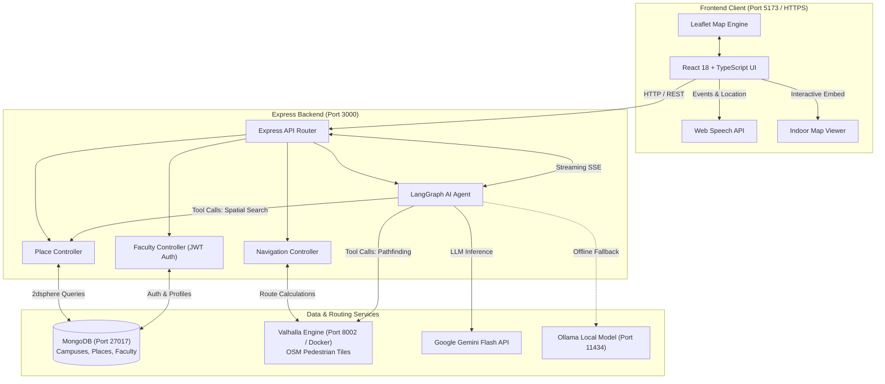

# DISHAA 2.0 — AI-Powered Virtual Campus Map

[](https://opensource.org/licenses/ISC)
[](https://nodejs.org/)
[](https://react.dev/)
[](https://www.typescriptlang.org/)
[](https://www.docker.com/)
[](https://www.mongodb.com/)
[](https://ai.google.dev/)

> **Next-Generation Autonomous Campus Navigation System with Turn-by-Turn Pedestrian Routing, Interactive Indoor Maps, Voice Guidance, and Conversational AI Assistant.**

---

## 📌 Overview

Navigating modern educational institutions and university campuses is often challenging for newcomers, freshmen, visiting dignitaries, faculty members, and students. Campuses consist of multi-story academic blocks, departmental laboratories, administrative divisions, dining hubs, athletic facilities, and parking zones spread across wide geographic areas. Traditional generic mapping applications frequently fail inside campus grounds due to missing private pedestrian walkways, lack of indoor floor plans, and absence of context-aware institutional knowledge.

**DISHAA 2.0** solves this problem for the **G H Raisoni College of Engineering and Management (GHRCEM), Nagpur** by providing a comprehensive, full-stack campus navigation ecosystem:

- **High-Precision Pedestrian Navigation**: Utilizes a self-hosted Valhalla routing engine compiled against custom OpenStreetMap (OSM) pedestrian footways to generate exact walking paths.
- **Dynamic Live Location Tracking & Voice Navigation**: Continuously tracks GPS position with auto-recalculation when off-route and delivers hands-free spoken maneuver instructions.
- **Multimodal Conversational AI Assistant**: Powered by LangGraph and Google Gemini (with Ollama fallback), allowing visitors to ask questions in natural language and receive real-time streaming directions and contextual information.
- **Interactive Indoor Navigation & Faculty Directory**: Explores academic buildings down to individual floors and rooms, linking staff offices directly with turn-by-turn routing.

---

## ✨ Key Features

### 🗺️ Interactive Campus Map
- **Custom Campus Geospatial Layer**: Built with Leaflet and React-Leaflet, displaying high-resolution campus boundaries, buildings, sports grounds, canteens, gates, and parking areas.
- **Rich Visual Landmarks**: Custom branded map markers with category-specific color coding, interactive tooltips, and detailed bottom sheet cards.
- **Quick Recenter & Zoom Controls**: Responsive zoom, compass reset, and viewport-fitting utilities for desktop and mobile devices.

### 🔍 Campus Search & Point of Interest (POI) Discovery
- **Instant Search**: Real-time autocomplete and fuzzy text search across campus blocks, offices, amenities, and landmarks.
- **Categorized Directory**: Fast filtering by categories: *Academic*, *Food & Cafes*, *Sports*, *Offices*, *Hostels*, *Facilities*, *Parking*, and *Gates*.
- **Database & GeoJSON Resilience**: Backed by MongoDB 2dsphere spatial indexes with an automatic fallback cache using verified local GeoJSON data.

### 🚶 Walking Navigation & Route Visualization
- **Pedestrian Routing Engine**: Computes realistic walking paths utilizing Valhalla's `pedestrian` costing model instead of motor vehicle roads.
- **Maneuver Breakdown**: Step-by-step turn guidance displaying distance in meters, walking time estimates in minutes, and turn directions.
- **Flexible Origin & Destination**: Select start and end points via text search, tapping pins directly on the map, or using live device coordinates.

### 📍 Live Location Tracking & Off-Route Recalculation
- **Real-Time GPS Tracking**: HTML5 Geolocation `watchPosition` engine tracking user coordinates with smooth interpolation and accuracy indicators.
- **Campus Boundary Awareness**: Automated containment check preventing invalid routing attempts when outside the campus geographic envelope.
- **Off-Route Detection (`40m` Threshold)**: Detects when a pedestrian wanders more than 40 meters off the calculated polyline and triggers automatic rerouting without user intervention.

### 🔊 Voice-Guided Navigation
- **Hands-Free Speech Synthesis**: Uses the Web Speech API (`SpeechSynthesis`) to announce turn directions at three distinct stages: *cruising*, *approaching*, and *immediate turn*.
- **Smart Voice Queue**: Priority-based voice dispatcher (`high` vs `normal`) with deduplication keys to prevent audio overlap and repetitive prompts.

### 🤖 AI-Powered Conversational Campus Assistant
- **LangGraph State Machine**: Orchestrates user intent recognition, campus entity extraction, and navigation action execution.
- **Google Gemini & Ollama Hybrid**: Default server-side Google Gemini Flash streaming (`/api/assistant/chat/stream` via Server-Sent Events) with configurable local Ollama fallback (`qwen2.5-coder:7b`).
- **Context-Aware Navigation Queries**: Users can ask natural queries mid-walk (e.g., *"Where am I heading?"*, *"What is my next turn?"*, *"How much distance is left?"*, or *"Take me to Canteen 1"*).

### 🏢 Indoor Navigation (Implemented)
- **Multi-Block & Multi-Floor Viewer**: Dedicated interactive indoor viewer (`/indoor-viewer/index.html`) integrated into the application shell.
- **Supported Blocks**:
  - **Block A**: Ground Floor (Floor 0)
  - **Block B**: Floors 1, 2, 3, and 4
  - **Block C**: Ground Floor (Floor 0)
- **Room-to-Door Wayfinding**: Visual indoor floor plans mapping classrooms, laboratories, seminar halls, and departmental offices.

### 👨‍🏫 Faculty Portal & Directory (Implemented)
- **Full Faculty Registry**: Search and filter faculty members by name, department, academic block, floor, or room number.
- **Direct Wayfinding Integration**: One-click *"Navigate to Office"* button automatically opens the indoor map focused on the exact room and floor.
- **Authenticated Self-Service Portal**: Secure faculty login and registration powered by bcrypt password hashing and JWT authentication tokens.

---

## 📸 Screenshots

| Campus Map & Landmark Discovery | Step-by-Step Walking Navigation |
| :---: | :---: |
|  <br> *Interactive campus map with categorized POIs* |  <br> *Turn-by-turn pedestrian pathfinding* |

| Conversational AI Assistant | Interactive Multi-Floor Indoor Maps |
| :---: | :---: |
|  <br> *Natural language campus query & streaming guidance* | *Dedicated indoor floor viewer with room-level wayfinding* |

---

## 🛠️ Technology Stack

### Frontend
| Technology | Version | Purpose |
| :--- | :--- | :--- |
| **React** | `^18.3.1` | Component-driven user interface |
| **TypeScript** | `^5.6.3` | Type safety and robust interface contracts |
| **Vite** | `^5.4.10` | High-speed frontend build tool and dev server |
| **Leaflet** | `^1.9.4` | Open-source mobile-friendly interactive maps |
| **React-Leaflet** | `^4.2.1` | React bindings for Leaflet map elements |
| **Web Speech API** | Native Browser | Audio voice maneuver announcements |
| **Vanilla CSS** | Custom CSS3 | Glassmorphism, animations, responsive design tokens |

### Backend API
| Technology | Version | Purpose |
| :--- | :--- | :--- |
| **Node.js** | `>=18.0.0` | JavaScript runtime environment |
| **Express** | `^4.19.2` | REST API framework and SSE streaming server |
| **MongoDB & Mongoose** | `^8.5.1` | Geospatial entity storage (`2dsphere` indexes) |
| **LangGraph.js** | `^1.4.9` | Stateful graph orchestration for the AI agent |
| **Google GenAI SDK** | `^2.21.0` | Google Gemini Flash LLM integration |
| **LangChain Ollama** | `^1.3.0` | Local offline LLM fallback runtime |
| **jsonwebtoken & bcryptjs** | `^9.0.3` / `^3.0.3` | Password hashing and JWT authentication |
| **CORS & Dotenv** | `^2.8.5` / `^16.4.5` | Origin protection and environment configuration |

### Routing Engine & Infrastructure
| Technology | Source / Version | Purpose |
| :--- | :--- | :--- |
| **Valhalla** | `ghcr.io/gis-ops/docker-valhalla:latest` | Open-source routing engine for pedestrian graph |
| **Docker Compose** | Docker Engine | Container orchestration for Valhalla routing service |
| **OpenStreetMap (OSM)** | `data/reference/campus.osm` | Authoritative source data for pedestrian ways |

---

## 🏛️ System Architecture



---

## 📂 Project Folder Structure

```
DISHAA 2.O/
├── data/                                 # Geographic and routing datasets
│   ├── reference/
│   │   ├── campus.osm                    # Authoritative OpenStreetMap XML data
│   │   ├── campus.geojson                # GeoJSON features (campuses, POIs, boundaries)
│   │   ├── ANALYSIS.md                   # Geospatial data reconciliation analysis
│   │   └── README.md
│   └── valhalla/                         # Valhalla routing tiles (generated by Docker)
├── DISHAA---VIRTUAL-CAMPUS-MAP/          # Frontend Web Application (React + Vite + TS)
│   ├── public/
│   │   ├── indoor-viewer/                # Multi-block indoor floor plans & room navigator
│   │   │   ├── A-Block/                  # Block A floor assets
│   │   │   ├── B-Block/                  # Block B floor assets
│   │   │   ├── C-Block/                  # Block C floor assets
│   │   │   ├── index.html                # Standalone indoor viewer runtime
│   │   │   └── indoor-viewer.js          # Indoor pathfinding & DOM rendering engine
│   │   ├── disha-logo.png
│   │   └── rgi-logo.png
│   ├── src/
│   │   ├── components/
│   │   │   ├── assistant/                # AI assistant chat drawer & message items
│   │   │   ├── landing/                  # Homepage hero, feature strip & Faculty Portal
│   │   │   ├── layout/                   # Header, IndoorMapDialog, modal shells
│   │   │   ├── map/                      # Leaflet map container, markers, route polyline
│   │   │   ├── navigation/               # Route summary, turn instructions panel
│   │   │   ├── places/                   # Place details sheet & category chips
│   │   │   ├── search/                   # Campus search input & autocomplete dropdown
│   │   │   └── ui/                       # Reusable buttons, badges, and cards
│   │   ├── hooks/                        # Custom React hooks (geolocation, live guidance, speech)
│   │   ├── services/                     # API client, voice navigation service
│   │   ├── utils/                        # Polyline decoders, distance formulas (Haversine)
│   │   ├── App.tsx                       # Main campus map application root
│   │   ├── Root.tsx                      # Hash-based view router (landing, map, faculty)
│   │   └── main.tsx                      # Vite React entrypoint
│   ├── .env.example                      # Frontend environment variable template
│   ├── package.json                      # Frontend dependencies and build scripts
│   ├── tsconfig.json                     # TypeScript configuration
│   └── vite.config.ts                    # Vite dev server & proxy configuration
├── scripts/                              # Automated test suites, E2E benchmarks & screenshots
│   ├── screenshots/                      # Viewport testing captures
│   ├── benchmark_gps_to_voice.js         # Voice latency benchmark script
│   └── playwright-responsive-checks.js   # Multi-screen responsiveness tests
├── src/                                  # Backend API Application (Node.js + Express)
│   ├── ai/
│   │   ├── graph/
│   │   │   └── campusAgent.js            # LangGraph agent definition & state management
│   │   └── tools/
│   │       └── campusTools.js            # Spatial query tools & GeoJSON offline cache
│   ├── config/
│   │   └── db.js                         # Mongoose connection handler
│   ├── controllers/
│   │   ├── facultyController.js          # Faculty directory & authentication handler
│   │   ├── navigationController.js       # Turn-by-turn route controller
│   │   └── placeController.js            # POI search and proximity controller
│   ├── middleware/
│   │   └── auth.js                       # JWT token authentication middleware
│   ├── models/
│   │   ├── Campus.js                     # Campus boundary & metadata schema
│   │   ├── Faculty.js                    # Faculty member profile & auth schema
│   │   └── Place.js                      # Searchable POI & GeoJSON Point schema
│   ├── routes/
│   │   ├── aiRoutes.js                   # /api/assistant endpoints (chat, streaming SSE)
│   │   ├── facultyRoutes.js              # /api/faculty endpoints (directory, auth)
│   │   ├── navigationRoutes.js           # /api/navigation endpoints (Valhalla proxy)
│   │   └── placeRoutes.js                # /api/places endpoints (search, nearby)
│   ├── scripts/
│   │   ├── importGeoJSON.js              # Imports campus.geojson into MongoDB
│   │   ├── seedFaculty.js                # Seeds verified faculty directory
│   │   └── validateDB.js                 # Verifies database integrity & spatial indexes
│   ├── services/
│   │   ├── ai/                           # Gemini & Ollama provider implementations
│   │   └── valhallaService.js            # Valhalla HTTP API client
│   ├── app.js                            # Express application setup & middleware
│   └── server.js                         # Server entry point & graceful shutdown
├── .env.example                          # Backend environment variable template
├── DATABASE.md                           # Database schema specifications & spatial indices
├── docker-compose.yml                    # Docker service configuration for Valhalla
├── package.json                          # Backend dependencies and management scripts
└── VALHALLA.md                           # Operations guide for the Valhalla routing container
```

---

## 📋 Prerequisites & Environment Variables

### Prerequisites
1. **Node.js**: Version `18.0.0` or higher ([Download Node.js](https://nodejs.org/)).
2. **MongoDB**: Local Community Server `v6.0+` or a [MongoDB Atlas](https://www.mongodb.com/atlas) cloud URI.
3. **Docker Desktop**: Required to execute the GIS-Ops Valhalla container ([Download Docker](https://www.docker.com/)).
4. **Google Gemini API Key**: Free tier or paid API key from [Google AI Studio](https://aistudio.google.com/) *(required for Gemini AI streaming)*.
5. **Ollama** *(Optional)*: If running the offline AI assistant locally ([Download Ollama](https://ollama.com/)).

---

### Environment Variables

> [!CAUTION]
> **Security Notice**: Never commit `.env` files, API keys, database credentials, or JWT secrets to GitHub or public version control. Keep `.env` files in your `.gitignore`.

#### 1. Backend Environment Variables (`.env` in root)
Copy `.env.example` to `.env`:
```bash
cp .env.example .env
```

| Variable | Default Value | Description |
| :--- | :--- | :--- |
| `PORT` | `3000` | Port for the Express backend server |
| `NODE_ENV` | `development` | Runtime environment (`development` / `production`) |
| `MONGODB_URI` | `mongodb://127.0.0.1:27017/dishaa_db` | MongoDB connection string |
| `VALHALLA_URL` | `http://localhost:8002` | HTTP base URL of the running Valhalla service |
| `AI_PROVIDER` | `gemini` | Active AI provider (`gemini` or `ollama`) |
| `GEMINI_API_KEY` | `""` | Google Gemini API Key (keep secret) |
| `GEMINI_MODEL` | `gemini-flash-lite-latest` | Gemini model name (`gemini-flash-lite-latest`, `gemini-2.5-flash`) |
| `GEMINI_TIMEOUT_MS` | `15000` | Gemini API request timeout in milliseconds |
| `OLLAMA_BASE_URL` | `http://localhost:11434` | Base URL for local Ollama instance (if used) |
| `OLLAMA_MODEL` | `qwen2.5-coder:7b` | Model name pulled in local Ollama |
| `OLLAMA_TIMEOUT_MS` | `20000` | Ollama inference timeout in milliseconds |
| `JWT_SECRET` | *(Optional in dev)* | Secret key for signing faculty authentication tokens |
| `CORS_ORIGIN` | `https://localhost:5173` | Allowed frontend origin(s), comma-separated |

#### 2. Frontend Environment Variables (`DISHAA---VIRTUAL-CAMPUS-MAP/.env`)
Copy `.env.example` to `.env`:
```bash
cp DISHAA---VIRTUAL-CAMPUS-MAP/.env.example DISHAA---VIRTUAL-CAMPUS-MAP/.env
```

| Variable | Default Value | Description |
| :--- | :--- | :--- |
| `VITE_API_BASE_URL` | `http://localhost:3000/api` | Base URL of the backend API (or leave blank to use Vite proxy) |

---

## 🚀 Complete Local Setup Guide

Follow these sequential steps to run the complete DISHAA 2.0 ecosystem locally:

### Step 1: Clone the Repository
```bash
git clone https://github.com/jilani-sheikh/DISHAA-2.0-AI.git
cd DISHAA-2.0-AI
```

---

### Step 2: Launch Valhalla Routing Engine (Docker)
The pedestrian routing engine processes `data/reference/campus.osm` inside a Docker container.

1. Prepare the Valhalla data volume by ensuring a copy of `campus.osm` exists in `data/valhalla/`:
   ```powershell
   # Windows PowerShell
   Copy-Item "data\reference\campus.osm" "data\valhalla\campus.osm" -Force
   ```
   ```bash
   # Linux / macOS
   cp data/reference/campus.osm data/valhalla/campus.osm
   ```

2. Start the Valhalla container:
   ```bash
   docker compose up -d
   ```

3. Monitor container startup and tile generation (takes ~1 minute on first run):
   ```bash
   docker compose logs -f
   ```
   *Wait until you see:* `Listening on port 8002`

4. Verify Valhalla health:
   ```bash
   curl http://localhost:8002/status
   ```

---

### Step 3: Set Up & Start Backend API
1. Install backend dependencies from the root directory:
   ```bash
   npm install
   ```

2. Configure the `.env` file:
   ```bash
   cp .env.example .env
   # Open .env and insert your GEMINI_API_KEY if testing AI features
   ```

3. Ensure MongoDB is running locally (e.g., via MongoDB Compass or Windows Service `net start MongoDB`).

4. Import campus spatial datasets and seed faculty data:
   ```bash
   # Import GeoJSON places and campus boundary into MongoDB
   npm run import

   # Validate database integrity and spatial indexes
   npm run validate:db

   # Seed initial faculty directory
   npm run seed:faculty
   ```

5. Start the backend development server:
   ```bash
   npm run dev
   ```
   *Backend runs on:* `http://localhost:3000`  
   *Verify health:* `http://localhost:3000/api/health`

---

### Step 4: Set Up & Start Frontend Application
1. Navigate into the frontend directory:
   ```bash
   cd DISHAA---VIRTUAL-CAMPUS-MAP
   ```

2. Install frontend dependencies:
   ```bash
   npm install
   ```

3. Configure frontend `.env`:
   ```bash
   cp .env.example .env
   ```

4. Start the Vite development server:
   ```bash
   npm run dev
   ```

5. Open your browser:
   - Access: `https://localhost:5173`
   - *Note on SSL*: The dev server uses `@vitejs/plugin-basic-ssl` to enable HTTPS, which is required by modern browsers to grant HTML5 Geolocation permissions (`watchPosition`). Accept the local development certificate warning in your browser.

---

### 🌐 Verified Local Endpoints & Ports

| Service | Address | Description |
| :--- | :--- | :--- |
| **Frontend Web App** | `https://localhost:5173` | Main interactive user interface |
| **Indoor Viewer** | `https://localhost:5173/indoor-viewer/index.html` | Floor-by-floor indoor navigator |
| **Backend REST API** | `http://localhost:3000` | Express API server |
| **API Health Status** | `http://localhost:3000/api/health` | Real-time status of DB, Valhalla & AI |
| **Valhalla Routing** | `http://localhost:8002/status` | Dockerized Valhalla status endpoint |
| **MongoDB Instance** | `mongodb://127.0.0.1:27017/dishaa_db` | Primary document database |

---

## ☁️ Deployment Architecture & Hosting Guidelines

When moving DISHAA 2.0 to production, different architectural components have distinct hosting and runtime requirements. **The complete project cannot be deployed to Vercel alone.**

```
┌─────────────────────────────────────────────────────────────────────────────┐
│                           PRODUCTION ARCHITECTURE                           │
└─────────────────────────────────────────────────────────────────────────────┘
          Frontend (SPA)                         Backend Services
    ┌─────────────────────────┐             ┌─────────────────────────┐
    │     Vercel / Netlify    │             │   Render / Fly.io / EC2 │
    │  React 18 + Vite Bundle │             │  Express API + LangGraph│
    │  Static Indoor Viewer   │             └────────────┬────────────┘
    └───────────┬─────────────┘                          │
                │                                        │
                ▼                                        ▼
    ┌─────────────────────────┐             ┌─────────────────────────┐
    │     Custom Domain       │             │   Docker Host / VPS     │
    │  https://dishaa.edu     │             │ Valhalla Routing (8002) │
    └─────────────────────────┘             └────────────┬────────────┘
                                                         │
                                                         ▼
                                            ┌─────────────────────────┐
                                            │      MongoDB Atlas      │
                                            │ Cloud Database Cluster  │
                                            └─────────────────────────┘
```

### Component Deployment Breakdown

1. **Frontend (`DISHAA---VIRTUAL-CAMPUS-MAP`) -> Vercel / Netlify (Supported)**
   - Can be built into static production assets (`npm run build`).
   - Easily deployable to **Vercel**, **Netlify**, or **Cloudflare Pages**.
   - Requires setting `VITE_API_BASE_URL` to your production backend URL (e.g., `https://api.dishaa.example.com/api`).
   - Static indoor viewer assets (`public/indoor-viewer/`) are bundled directly with the build.

2. **Backend API (`src/`) -> Render, Railway, Fly.io, or AWS (Node.js Container)**
   - **Cannot run purely on Vercel Serverless Functions** without adaptation due to:
     - Long-lived Server-Sent Events (SSE) connections for streaming AI responses (`/api/assistant/chat/stream`).
     - Persistent MongoDB connection pooling.
     - HTTP reverse-proxying to the Valhalla routing daemon.
   - Recommended hosting: **Render Web Service**, **Railway**, **Fly.io**, or an **AWS ECS / DigitalOcean App Platform** container.

3. **Routing Engine (Valhalla) -> VPS / Docker Host**
   - Requires a persistent Docker environment with at least **2 GB of RAM** to load routing tiles into memory.
   - Deploy using `docker compose` on an **AWS EC2**, **DigitalOcean Droplet**, **Hetzner Cloud VPS**, or any Linux server with Docker.
   - Ensure port `8002` is accessible by your backend API (keep firewalled from public traffic).

4. **Database (MongoDB) -> MongoDB Atlas**
   - Use a managed [MongoDB Atlas](https://www.mongodb.com/atlas) M0/M10 cluster.
   - Configure Network Access to allow inbound connections from the backend hosting provider's IP range.
   - Spatial 2dsphere indexes are fully supported out-of-the-box.

5. **AI Service -> Google Gemini API**
   - Completely serverless via Google Gemini API keys.
   - No persistent GPU instances needed when `AI_PROVIDER=gemini`.

---

## 📡 REST API & Service Overview

### Health & Monitoring
| Method | Endpoint | Description |
| :--- | :--- | :--- |
| `GET` | `/api/health` | Comprehensive system health check (MongoDB status, Valhalla availability, AI readiness) |
| `GET` | `/api/assistant/health` | Specific status of configured AI provider and active model |

### Campus Places & Points of Interest
| Method | Endpoint | Description |
| :--- | :--- | :--- |
| `GET` | `/api/places` | List searchable places; accepts optional `?category=` filter |
| `GET` | `/api/places/search?q=:query` | Full-text and regex search across place names and descriptions |
| `GET` | `/api/places/nearby?lon=:lon&lat=:lat&radius=:m` | Geospatial `$near` lookup within specified meter radius |
| `GET` | `/api/places/:id` | Fetch detailed entity information for a single place |

### Navigation & Routing
| Method | Endpoint | Description |
| :--- | :--- | :--- |
| `POST` | `/api/navigation/route` | Compute turn-by-turn route between coordinate pairs `[startLon, startLat]` and `[endLon, endLat]` |
| `POST` | `/api/navigation/route-between-places` | Compute pedestrian route between two MongoDB Place IDs or names |

### AI Assistant
| Method | Endpoint | Description |
| :--- | :--- | :--- |
| `POST` | `/api/assistant/chat` | Synchronous JSON conversational response from LangGraph agent |
| `POST` | `/api/assistant/chat/stream` | Real-time Server-Sent Events (SSE) token stream with final action payload |

### Faculty Directory & Authentication
| Method | Endpoint | Description |
| :--- | :--- | :--- |
| `GET` | `/api/faculty` | Filter faculty by `department`, `block`, `floor`, `roomNo`, or search query `q` |
| `POST` | `/api/faculty` | Multi-action endpoint: login (`action: "login"`) or registration (`action: "register"`) |
| `GET` | `/api/faculty/:id` | Retrieve single faculty profile details |
| `PUT` | `/api/faculty/:id` | Update profile information *(Requires JWT Bearer token)* |
| `DELETE` | `/api/faculty/:id` | Remove faculty record *(Requires JWT Bearer token)* |

---

## 🔮 Roadmap & Future Improvements

- [ ] **3D Digital Twin & 360° Photospheres**: Integration of interactive 360° panoramic imagery for critical campus junctions.
- [ ] **Augmented Reality (AR) Wayfinding**: Smartphone camera AR arrows overlaying real-time directional cues onto the physical environment.
- [ ] **Accessibility-First Routing**: Adding wheelchair-accessible route options avoiding stairs and steep terrain.
- [ ] **Campus Transit & Shuttle Tracker**: Live tracking for inter-campus student shuttles and parking occupancy sensors.
- [ ] **Progressive Web App (PWA) Offline Caching**: Service Worker caching for map tiles and vector polygons to allow offline navigation when cellular data is poor.

---

## 👥 Contributors & Acknowledgments

Developed with ❤️ by the **DISHAA Team** at **G H Raisoni College of Engineering and Management (GHRCEM), Nagpur**.

- **Institutional Guidance & Mentorship**: Department of Information Technology, GHRCEM Nagpur.
- **Mapping Data**: OpenStreetMap contributors & GHRCEM Campus Survey.

---

## 📄 License

This project is licensed under the **ISC License**. See the [package.json](package.json) file for details.
